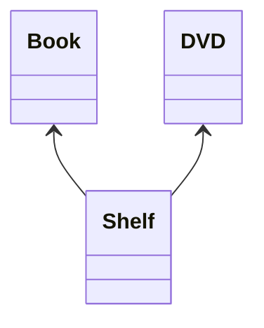
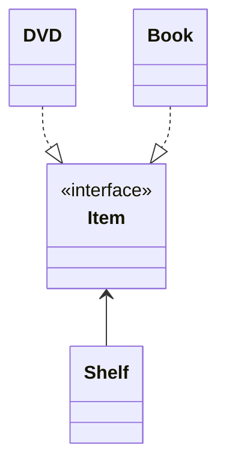
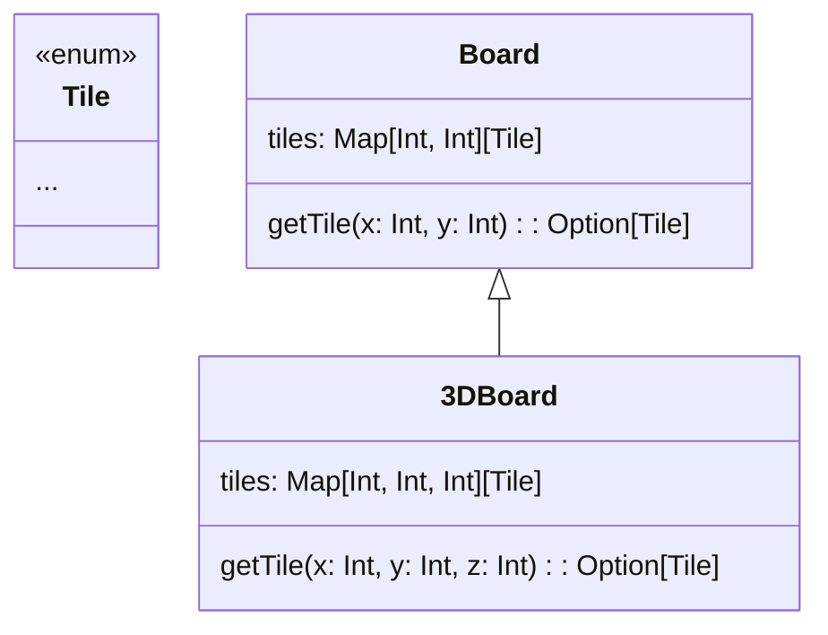

# Exercises #12 - Design Principles

## Task 0: Revise SOLID

**SOLID**
- **S**ingle Responsibility Principle: _A component (class, function, module, ...) should only have one reason to change._
- **O**pen–Closed Principle: _A component should be open for extension, but closed for modifications._
- **L**iskov Substitution Principle: _Subtypes must be behaviorally substitutable for their base types._
- **I**nterface Segregation Principle: _Clients should not be forced to depend upon interfaces that they do not use._
- **D**ependency Inversion Principle: _High-level modules should not depend on low-level modules. Both should depend upon abstractions [not concretions]._

## Task 1: SOLID, part 1

A student is building a management software for physical storage.
Their first UML design includes the following:

The tutor suggested this alternative design:

**Question**: Explain what SOLID design principle(s) the tutor's revised design adheres to.

**Dependency Inversion Principle**: An abstraction (Item interface) is introduced between the high-level classes (Shelf) and low-level classes (Book & DVD) that changes the direction of the dependency and splits the dependency between the high-level and low-level modules.

**Open-Closed Principle**: To extend the application, e.g. to use other "items", all needs to be done is to add another concrete implementation of the Item interface. The extention (adding a new Item) will not require any changes to the classes already exsiting in the model.

## Task 2: SOLID, part 2

Assume that you're implementing a board game (for example chess) which uses a 2D square-shaped board. You defined a class `Board` which stores all the tiles in it in a map.

You also implemented many methods (including getters and setters), among which there is `getTile(x, y)` returning a tile in the `(x, y)` location.
Later the requirements change and you need to support 3D boards as well.
A 3D board _is_ a board, so you decide to extend the existing `Board` class and come up with the following design:

**Questions**: Is this a reasonable design? Take the SOLID principles into account!
How would you improve the design?

This design goes against **Liskov Substitution Principle (LSP)**.

At first glance, it may seem a good decision to make 3DBoard a subclass of Board class. Board provides a 2D board and functionalities over two dimensions, and 3DBoard can inherit all that and add a new dimension. The problem though is that many of Board's methods, such as the given `getTile()`, are designed to work with two dimension units, not three. So, they lose their context/meaning when it comes to three dimensions. For instance, `getTile(int, int)` loses its meaning in 3DBoard as `getTile(int, int, int)` makes more sense.

Thus, a client code attempting to use the 3DBoard class as its base class Board would be very out of luck, which is what LSP is about i.e. being able to substitute base class objects with subclass objects.

## Task 3: Analysis and Design

Your Teamprojekt is to implement a new forum-like system for Software Engineering.
One of your team members defines the following User Story:

> 1. **As a** professor,
> 2. **I want** to post announcements
> 3. **so that** they appear on my students' feed where they can read them.

### Part 1

You are implementing this User Story.
What classes will be in your "model" (for example a UML class diagram?) 
_Only name the classes._

Professor, Announcement, and Student, Feed can be possible model classes.

### Part 2

Come up with two more requirement in the form of a User Story:

> 1. **As a** `user role concerned by the story`,
> 2. **I want** `goal of the story`,
> 3. **so that** `reason for the story`.

## Task 4: Markdown

_This task has three parts, part `N` is in `./MarkdownN`._

To start, see `./Markdown1/README.md`. Then continue to part 2 and part 3.
